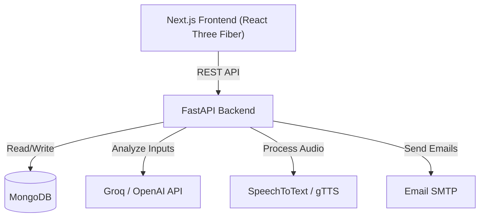

# ⚡ Flash Coach

[](https://just-in-time-flash-coach-gv4qc27gf-srirams-projects-d3650924.vercel.app/)
[](https://opensource.org/licenses/MIT)
[](https://nextjs.org/)
[](https://fastapi.tiangolo.com/)

Flash Coach is a cutting-edge, AI-powered coaching platform designed to provide accessible, "Just-In-Time" feedback and guidance. Built with a modern Next.js frontend and a robust FastAPI backend, it leverages advanced audio processing and Large Language Models (LLMs) to deliver personalized coaching experiences.

## 📑 Table of Contents
- [System Architecture](#-system-architecture)
- [Software Development Life Cycle (SDLC)](#-software-development-life-cycle-sdlc)
- [Features](#-features)
- [Tech Stack](#️-tech-stack)
- [Prerequisites](#-prerequisites)
- [Installation & Setup](#️-installation--setup)
- [Deployment](#-deployment)
- [Contributing](#-contributing)
- [License](#-license)

## 🏗️ System Architecture

Flash Coach follows a modern, decoupled **Client-Server Architecture**, designed for scalability and high performance:

*   **Presentation Layer (Frontend)**: Developed using Next.js 16 and React 19. It acts as the interactive client, communicating with the backend via RESTful APIs. It integrates **React Three Fiber** for an immersive 3D user interface.
*   **Application Layer (Backend)**: A high-performance **FastAPI** Python application that manages business logic, AI prompt orchestration, and audio stream processing.
*   **Data Layer (Database)**: **MongoDB** is utilized for flexible, document-based storage of user profiles, session histories, and authentication metadata.
*   **AI & External Integrations**: 
    *   **LLM Providers**: Integration with **Groq** and **OpenAI** for natural language understanding and insight generation.
    *   **Audio Processing**: Uses `speechrecognition` for speech-to-text input and `gTTS` for text-to-speech feedback.



## 🔄 Software Development Life Cycle (SDLC)

Flash Coach is developed following an **Iterative Agile Methodology**, ensuring rapid feature delivery and continuous refinement based on user interaction with the AI.

1.  **Requirement Analysis & Planning**: Defined the scope of an AI coaching tool emphasizing low-latency audio feedback and immersive 3D visuals.
2.  **Design & Prototyping**: 
    - UI/UX wireframing for the Next.js frontend.
    - System architecture design for the decoupled FastAPI and MongoDB backend.
3.  **Implementation (Development)**:
    - Independent development of the Next.js frontend and FastAPI backend.
    - Integration of WebGL (Three.js) components.
    - Implementation of 2FA and secure authentication flows (PyOTP, Bcrypt).
4.  **Testing**:
    - Unit testing backend API routes.
    - End-to-End testing of the audio-capture to AI-response pipeline.
5.  **Deployment (CI/CD)**:
    - **Frontend**: Automated deployments to **Vercel** targeting the `main` branch.
    - **Backend**: Containerized and cloud-hosted deployments to **Render**.
6.  **Maintenance & Iteration**: Continuous monitoring of AI API latency, token usage, and user feedback to refine prompt engineering and system stability.

## 🚀 Features

*   **AI-Powered Insights**: Utilizes Groq and OpenAI to analyze user inputs and provide intelligent feedback.
*   **Voice Interaction**: Integrated speech recognition and text-to-speech (gTTS) for seamless audio-based coaching sessions.
*   **Interactive 3D UI**: Immersive user interface built with React Three Fiber.
*   **Secure Authentication**: Robust user management with 2FA support (PyOTP) and secure password hashing.
*   **Real-time Feedback**: Instant analysis and response generation.
*   **Automated Notifications**: Email integration for progress updates and session summaries.
*   **Multi-language Support**: Translation capabilities powered by deep-translator.

## 🛠️ Tech Stack

### Frontend
*   **Framework**: Next.js 16 (React 19)
*   **Language**: TypeScript
*   **Styling**: Tailwind CSS v4
*   **UI Components**: Radix UI, Lucide React
*   **3D Graphics**: Three.js, React Three Fiber

### Backend
*   **Framework**: FastAPI
*   **Database**: MongoDB (PyMongo)
*   **AI/LLM**: Groq, OpenAI API
*   **Audio Processing**: SpeechRecognition, gTTS
*   **Authentication**: PyOTP, Bcrypt, JWT

## 📋 Prerequisites

*   Node.js (v18+ recommended)
*   Python 3.10+
*   MongoDB instance (local or Atlas)

## ⚙️ Installation & Setup

### 1. Clone the Repository
```bash
git clone https://github.com/Sriram4232/Just-In-Time_Flash-Coach.git
cd Just-In-Time_Flash-Coach
```

### 2. Backend Setup
Navigate to the backend directory and set up the Python environment.

```bash
cd backend

# Create a virtual environment
python -m venv venv

# Activate the virtual environment
# On Windows:
venv\Scripts\activate
# On macOS/Linux:
source venv/bin/activate

# Install dependencies
pip install -r requirements.txt
```

**Environment Variables:**
Create a `.env` file in the `backend` directory and add your configuration parameters.

```env
# Example .env structure
MONGODB_URL=mongodb://localhost:27017
DB_NAME=flash_coach
SECRET_KEY=your_secret_key
OPENAI_API_KEY=your_openai_key
GROQ_API_KEY=your_groq_key
```

Run the backend server:
```bash
uvicorn app.main:app --reload
```

### 3. Frontend Setup
Navigate to the root directory (where `package.json` is located).

```bash
# Install dependencies
npm install

# Run the development server
npm run dev
```

Open [http://localhost:3000](http://localhost:3000) with your browser to see the application.

## 🌐 Deployment

The application follows a decoupled architecture:
*   **Frontend**: Hosted on [Vercel](https://just-in-time-flash-coach-gv4qc27gf-srirams-projects-d3650924.vercel.app/)
*   **Backend**: Hosted on [Render](https://just-in-time-flash-coach.onrender.com). *(Note: Free tier backends may sleep; allow ~60s for the first request.)*

## 🤝 Contributing

Contributions are welcome! Please feel free to submit a Pull Request to help improve the platform.

## 📄 License

This project is licensed under the MIT License.
